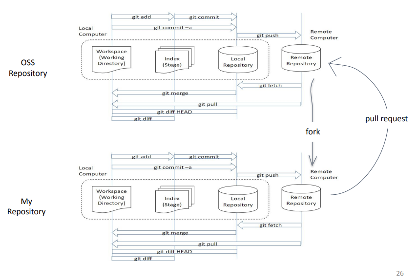

# **오픈소스SW개발론**

### Introduction

-------------
### Week1-1 강의 개요 (강의계획서)
* 수업시간: 월1월2, 수1 
* 강의실: AI 융합대학 106
* 교과요목: 이 과목은 **3가지 목표**를 지향한다. _첫째_, 오픈소스 소프트웨어 개발을 위한 기본 개념과 도구, 특히 소스 코드 버전
컨트롤과 패키지 관리, 프로젝트 빌드를 중점으로 배운다. _둘째_, 애자일 기반 소프트웨어 개발 방법인 짝프로그래밍, 테스트 주도 개발, 행위 주도 개발, 클라우드 기반 데브옵스를 공부한다. _셋째_, 새로운/낯선 소프트웨어 개발 환경 및 도구를 스스로 배우는 태도를 배우는 것을 목적으로 한다. 새로운 추세의 컴퓨팅 환경에 빠르게적응하여 협력적인 소프트웨어 개발을 주도할 수 있는 능력을 배운다.
* 수업 목표  
  1. **컴퓨팅 사고**  
  함수형 프로그래밍언어 스타일을 익힘
  2. **융합**  
   LLM/ChatGPT를 새로운 프로그래밍을 배우는데 활용
  3. **글로컬**  
  Git/Github를 통해 협업하는 방식을 배움  
영어 학습 자료를 공부함으로써 영어 활용 기회를 늘림
  4. **소프트웨어 응용 문제 해결 능력**   
   Basic concepts and tools for open-source software development  
(오픈소스 소프트웨어 기본 개념과 도구)  
Attitude to self-learn new SW tools and environments  
(새로운/낯선 소프트웨어 개발 환경 및 도구를 스스로 배우는 태도)  
Basic functional programming, Haskell   
(기초 함수형 프로그래밍 하스켈)

-------------
### Week1-2 오픈소스소프트웨어 개요
* What is Open Source Software?  
>Software whose copyright holder gives the right to publish, use, copy, modify, and distribute the source code to everyone.   
(소프트웨어 저작권 소유자가 모든 사람에게 소스 코드를 게시, 사용, 복사, 수정 및      배포할 권리를 부여한 소프트웨어)
* OSS License  
>The scope of use, reproduction, modification, and distribution rights of the open source software  
    (OSS라이선스 : 오픈소스 소프트웨어의 사용, 복제, 수정, 배포 권한의 범위를 지정)
* Commercialization View (상용화 관점)
  * Commercial SW (E.g. Windows)
    1. Individual License (EULA)   
      (개별 이용허락)
    2. Royalty (로열티 지급)  
    3. Binary only  
      (실행 바이너리만 제공)
    4. No reproduction, distribution, and modification  
      (복제, 배포, 수정 불가)  
    5. Limited terms and purposes  
      (사용 기간과 목적 제한)  
    6. _Protected by Intellectual Property Rights(지적재산권)_
  * Open Source SW
    1. Open Source Lincense  
      (일괄 사전 이용허락)  
    2. No Royalty   
    (로열티 없음)  
    3. Source code   
      (소스 코드 제공)  
    4. Reproduction, distribution, and modification are permitted  
      (복제, 배포, 수정 허용)  
    5. No limitation on terms and purposes  
    (기간/목적 제한 없음)  
    6. _Protected by Intellectual Property Rights(지적재산권)_
* Philosophical View (OSS에 대한 철학적 관점)  

* 오픈소프트웨어의 공통 주제
  1. 협업  
      - 도구: Git, GitHub
      - 공동 개발 규칙, 코드 리뷰, 회고  
  2. 빌드 시스템(+패키지 관리 시스템)
      - 개인 환경에 공개된 소스 코드를 빌드(컴파일)&설치하기 어려운 경우가 빈번
      - make, CMake, gradle, ant, maven, …

-------------
### Week2-1 버전 관리 개요
* Version Control System (VCS)
>Track your files over time so that you can easily get 
back to a previous working version  
* VCS software  
  - CVS (Concurrent Version System)  
  - SVN (Subversion)  
  - Mercurial  
  - Darcs  
  - Git  
*  Repository or Repo (저장소)  
1. **General Actions in VCS: Checkin**  
   Check in a file(list.txt) and modify it over time
2. **Checkout and editing**  
  Check out, edit, and check in a file(list.txt)  
3. **Diffs**  
 The trunk has a history of changes as a file evolves
4. **Branching**  
   Copy code into a separate folder so we can have a 
separate history of changes  
5. **Merging**  
  Merge changes from one branch to another  
6. **Conflicts**  
  When changes overlap like an example below
    - How To Solve?
      -  _Re-apply_ your changes (r4 +Hot Dog)
      -  _Override_ their changes with yours (r4 -Cheese, +HotDog)
7. **Tagging**  
   Let you tag (label) any revision for easy reference 
such as ‘Release 1.0’ instead of r4
* Two Main Types of VCS
  1. Centralized VCS  
      - One central repository with many users  
      - E.g., CVS, SVN, Darcs  
  2. Decentralized (Distributed) VCS  
      - Every user owns his or her local repository  
      - A separate remote (central) repository  
        - Sometimes, more than one remote (central) repositories  
      - Two new actions (with remote repositories): fork pull request  
      - E.g., GIT, Mercurial   
* An Introduction to GIT
  - Linus Torvalds
    - For collaboration of development of Linux kernel
  - A distributed version control system
    - Workspace : files you are working with
    - Index: (staged) files to be considered in the next commit
    - Local repository : files committed to the local repo
    - Remote repository : files pushed to the remote repo
* An Introduction to GIT: Workflow

-------------
### Week2-2 Git
* Git이란?
  - Git == Histroy **_관리_** 하는 **_도구_**
  - Git 개발과정 , **_소스_** 파일 등을 **_관리_** 하는 **_도구_**
  - Histroy 관리가 되어 **_개발_** 되어온 **_과정_** , **_역사_** 를 볼 수 있고 , 특정시점으로 **_복구_** 가능
* Git 실습  
  - **Stage1**
    > 1. https://github.com/Taeung/git-training 에서 example_code_v2 다운
    >  2. c드라이브->사용자->sieun->에 압축 해체
    >  3.  cd ~
    >  4.  mkdir report-card 
    >  5.  cd report-card
    >  6.  git init
    >  7.  cp ..\git-training-ex-v2\commit1\report_card.c
    >  8.  git add .\report_card.pdf
    >  9.  git commit -m "report card: Add question PDF"
    >  10. cp ..\git-training-ex-v2\commit2\report_card.c
    >  11. git add report_card.c
    >  12. git commit -m "report card: Add base code"  
  - **Stage2**
    > 1. git staqtus
    > 2. cp ..\git-training-ex-v2\commit3\report_card.c
    > 3. git diff
    > 4. git add report_card.c
    > 5. git commit -m "report card: Print a message of introduction"
    > 6. git log
    > 7. cp ..\git-training-ex-v2\commit4\report_card.c
    > 8. git diff
    > 9. git add report_card.c
    > 10. git commit -m "report card: Print grades of each subject"
    > 11. git log  
  - **Stage3**
    > 1. cp ..\git-training-ex-v2\commit5\report_card.c
    > 2. git diff
    > 3. git add report_card.c
    > 4. git commit -sm "report card: Show the sum of each grade"
    > 5. cp ..\git-training-ex-v2\commit6\report_card.c
    > 6. git diff
    > 7. git add report_card.c
    > 8. git commit -sm "report card: Get a average of grades"
  - ** Stage4**
    > 1. git status
    > 2. git shortlog
    > 3. git remote add origin https://github.com/sieun1803/git-training.git
    > 4. git push origin master
  - **Stage5**
    > 1. cp ..\git-training-ex-v2\commit6-1\report_card.c
    > 2. git diff
    > 3. git add report_card.c
    > 4. git commit --amend
    > 5. git push origin master -> 오류 발생
    > 6. git push origin master --force
  - **Stage6**
    > 1. touch test; git add test -> vscode는 NewItem 명령어 사용
    > 2. git status
    > 3. git reset
    > 4. git status
  - **Stage7**
    > 1. git status
    > 2. git add test; git commit -sm “test”
    > 3. git push origin master
    > 4. git reset HEAD~1
    > 5. git push origin master --force
-------------
### Week2-3 Github, fork, pull request
* Pull-request?
  - **_다른프로젝트_** 에 내가 만든 **_commit_** 을 제출한다는 의미 (실제 전송단위는 branch)
  - **_상대방_** 프로젝트를 **_fork(복사)_** 해서   
  **_내 계정에서_** 관리되는 프로젝트로 **_새롭게_** 만들어 두고  
  그 fork 한 github 프로젝트를 토대로 새로운 **_commit 내용들을 pull-reqeust 제출_** 할 수 있다. 
  - **주의:** fork 는 본인 프로젝트를 대상으로 하는 게 아니다.  
* Git 실습
  - **Stage8**
    > 1. cd ~
    > 2. git clone https://github.com/sieun1803/git-training.git
    > 3. cd git-training
    > 4. git checkout -b develop
    > 5. cd pull_reqeust_test
    > 6. mkdir sieun1803; cd sieun1803
    > 7. git add < 나의 소스작업폴더 >
    > 8. git commit -sm “test pull request”
    > 9. git push origin develop
  - **Stage9**
    > 1. git branch
    > 2. git checkout -b test
    > 3. touch test; git add test; git commit -sm “test”
    > 4. git checkout develop; git status; git merge test
* Rebase?  
  - commit을 역사의 한단위 '**_블럭_**' 이라 하고 블럭들의 모임을 '**_tree_**' 라 할때  
  **_내가 쌓은 블럭_** 을 잠시 빼고  
  (뺀 나머지) 기준이 되는 tree를 **_최신 업데이트 한 후_** 에  
  **_그 위에 다시_** 내 블럭을 **_쌓아 올릴_** 때 쓸 수 있다.
  - **Stage10**
    > 1. git remote add upstream https://github.com/Taeung/git-training.git  
    -> 본인 url이 아님
    > 2. git fetch upstream dev
    > 3. git status
    > 4. git rebase upstream/dev
-------------
### Week3     Markdown
* **Italics and Bold**  
  * Italics: _ word_
  * Bold: ** word**
  * Italics and Bold: ** _ word_**
* **Headers**
  * #_
  * ##_
  * ###_
  * ####_
  * #####_
  * ######_
* **Links**
  * 대괄호(주소(URL))  
    -> 대괄호[ ] 안에는 태그 넣음
* **Images**
  * !대괄호(이미지주소)
* **Blockquotes**
  * ">"
* **Lists**
  * "*"
* **Paragraphs**
  * 스페이스 두번